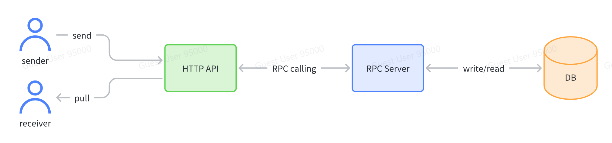

# TIkTok Immersion Assignment


# Implementing a backend Instant Messaging system

Code retrieved from https://github.com/TikTokTechImmersion/assignment_demo_2023.

The backend architecture is depicted as follows:


## Running the docker instances

Clone this repository and run a docker instance within the root directory, by using the command below.

```
$ docker-compose up -d
```

## Command for creating a chat instance into the database

To simulate an instance of sending a message to the HTTP API, run a curl command such as the one shown below in the terminal.

```
$ curl -X POST 'localhost:8080/api/send?sender=a&receiver=b&text=hi'
```

### Required URL field parameters
- __sender__: the sender of the message
- __receiver__: the receiver of the message
- __text__: the contents of the message

## Command for querying the database for a chat instance

To simulate an instance of querying the database for a chat instance, run a curl command such as the one shown below in the terminal.

```
$ curl 'localhost:8080/api/pull?chat=a%3Ab'
```

Or you can simply type the URL into your browser when the docker instance is running.

```
localhost:8080/api/pull?chat=a%3Ab
```

### Required URL field parameters
- __chat__: the chat instance to query for (must be in the format of `<name1>:<name2>`)

### Optional URL field parameters
- __limit__: an integer representing the maximum number of messages to query for (default is 10)
- __cursor__: an int64 value representing the Unix timestamp of the time to query messages before (default is the oldest message)
- __reverse__: a boolean value representing whether to reverse the order of the messages (default is false)

## Modifications to the original code

1. Modified `docker-compose.yml` file to define the additional Docker services:
    - `rpc-server`: RPC server service
    - `http-server`: HTTP server service
    - `etcd`: Etcd service for service discovery
    - `db`: PostgreSQL database service

2. Implemented the connecting send and pull functions between the RPC server and HTTP server

3. Incorporated the necessary logic to handle the `api/send` URL field parameters.
    - required `sender` and `receiver` parameters for sending a message
    - required `text` parameter for sending the content of the message

4. Incorporated the necessary logic to handle the `api/pull` URL field parameters.
    - required `chat` parameter for querying the chat instance
    - optional `limit` parameter to query for a limited number of messages
    - optional `cursor` parameter for querying messages after a certain time

5. Implemented a PostgreSQL database to store chat message instances.

6. Included error handling for wrong URL field parameters provided by client.

## Limitations faced

### Using an appropriate database

Despite the recommended database for this project being MySQL or Redis, I decided to use PostgreSQL instead. This was because I am more familiar with it. However, my implementation is far from perfect. The lack of usage of a framework such as `gorm` meant that I had to resort to raw SQL queries to implement the database. This provides possible unecessary issues such as errors in query syntax or security issues such as vulnerability to SQL injection attacks.

However, since security is not of concern for the requirements of this project, I decided to choose this approach.

### Choice of Database Primary Key

For the PostgreSQL databse, I decided to implement only one table due to the straightforward nature of the project assignment. As a result, I was faced with the problem of using an appropriate primary key for the database. My initial solution was to try and use the `chat` and `send_time` of a message instance as the primary key, but this meant that the system is unable to handle multiple message spams from within 1 second. only the first message instance within the same second will be recorded.

To solve this, I decided to include an additional `uuid` field in the table as the primary key. This frees up the constraints that I faced, thereby allowing multiple messages of the same chat instance at the same time to be sent.

### Software Engineering Practices

Of course there were multiple software engineering principles that I have violated due to my unfamiliarity with Go. For instance, I was unsure of the way each abstraction layer handles each request and response appropriately. I went about trying to design it as best as I could, but I am sure there are better ways to do it.

However, due to the simplicity of the project, I decided to leave it as it is.

## Conclusion

In conclusion, there are a few takeaways from this project. I have learnt how to:
- Use Go to implement a backend system
- Got more familiar with using Docker to containerize the backend system
- Solidify my knowledge of databases by incorporating a PostgreSQL database into the backend system
